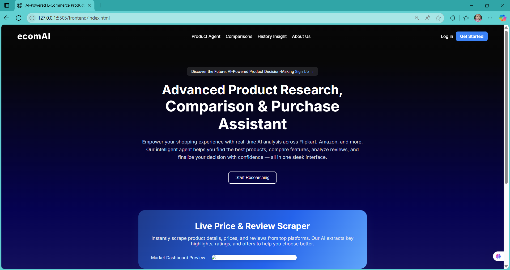

# 🤖 AI-Powered E-Commerce Product Agent

A sophisticated AI-driven e-commerce platform that helps users research, compare, and make informed purchasing decisions across multiple online marketplaces including Amazon, Flipkart, and more.



## 🚀 Features

### 🛍️ **Product Research & Discovery**

- **Multi-Platform Scraping**: Real-time product data from Amazon, Flipkart, and other major e-commerce sites
- **AI-Powered Analysis**: Intelligent product recommendations based on user preferences
- **Category-Based Browsing**: Organized product categories (Electronics, Audio, Laptops, Gaming, etc.)
- **Rich Product Information**: Prices, ratings, reviews, and detailed specifications

### 💬 **AI Chat Assistant**

- **Natural Language Processing**: Chat with AI to find products, compare features, and get recommendations
- **Contextual Responses**: AI understands user intent and provides relevant suggestions
- **Product Comparisons**: Side-by-side feature and price comparisons
- **Personalized Recommendations**: AI learns from user preferences and browsing history

### ❤️ **Wishlist & Price Tracking**

- **Smart Wishlist**: Save products with one-click favorites
- **Price Drop Alerts**: Get notified when prices decrease
- **Wishlist Management**: Organize and manage your saved products
- **Price History Tracking**: View price trends over time

### 📊 **Analytics & Insights**

- **Price Insights**: Historical price data and trend analysis
- **Market Analysis**: Competitive pricing and market trends
- **User Analytics**: Personalized shopping insights and recommendations
- **Product Performance**: Rating analysis and review sentiment

### 🔍 **Advanced Search & Filtering**

- **Semantic Search**: Find products using natural language queries
- **Advanced Filters**: Filter by price, rating, brand, and features
- **Smart Suggestions**: AI-powered search suggestions and autocomplete
- **Cross-Platform Search**: Search across multiple e-commerce platforms simultaneously

## 🏗️ Architecture

### **Frontend (HTML/CSS/JavaScript)**

- **Modern UI/UX**: Responsive design with beautiful gradients and animations
- **Real-time Updates**: Dynamic content loading and live price updates
- **Progressive Web App**: Works seamlessly across devices
- **Interactive Components**: Hover effects, toast notifications, and smooth transitions

### **Backend (Python/FastAPI)**

- **RESTful API**: Fast and scalable API endpoints
- **AI Integration**: OpenAI GPT and Google Gemini API integration
- **Database Management**: SQLite database with SQLAlchemy ORM
- **Web Scraping**: Automated data collection from e-commerce sites

### **AI & Machine Learning**

- **Natural Language Processing**: Understanding user queries and intent
- **Recommendation Engine**: Personalized product suggestions
- **Price Prediction**: AI-powered price forecasting
- **Sentiment Analysis**: Review analysis and product sentiment

## 🛠️ Technology Stack

### **Frontend**

- HTML5, CSS3, JavaScript (ES6+)
- Chart.js for data visualization
- Font Awesome for icons
- Responsive design with CSS Grid and Flexbox

### **Backend**

- Python 3.8+
- FastAPI for API development
- SQLAlchemy for database ORM
- SQLite for data storage
- JWT for authentication

### **AI & APIs**

- OpenAI GPT API for natural language processing
- Google Gemini API for AI assistance
- Web scraping with BeautifulSoup/Scrapy
- Real-time data processing

### **Development Tools**

- Git for version control
- Pipenv for dependency management
- VS Code for development
- Live server for frontend development

## 📦 Installation & Setup

### **Prerequisites**

- Python 3.8 or higher
- Node.js (optional, for frontend development)
- Git

### **1. Clone the Repository**

```bash
git clone https://github.com/yourusername/ai-ecom-agent.git
cd ai-ecom-agent
```

### **2. Backend Setup**

```bash
# Navigate to backend directory
cd backend

# Install Python dependencies
pip install -r requirements.txt

# Or using pipenv
pipenv install
pipenv shell
```

### **3. Environment Configuration**

```bash
# Copy environment template
cp .env.example .env

# Edit .env file with your API keys
nano .env
```

**Required Environment Variables:**

```env
# OpenAI API Configuration
OPENAI_API_KEY=your_openai_api_key_here

# Google Gemini API Configuration
GEMINI_API_KEY=your_gemini_api_key_here

# JWT Secret Key (change this!)
SECRET_KEY=your_super_secret_jwt_key_here

# Database Configuration (if using external database)
DB_HOST=localhost
DB_PORT=5432
DB_NAME=ecom_ai_db
DB_USER=your_db_user
DB_PASSWORD=your_db_password
```

### **4. Database Setup**

```bash
# Initialize database (SQLite will be created automatically)
python -c "from app.database import engine, Base; Base.metadata.create_all(bind=engine)"
```

### **5. Frontend Setup**

```bash
# Navigate to frontend directory
cd ../frontend

# Serve frontend files (using Python's built-in server)
python -m http.server 8000

# Or using Node.js live server
npx live-server --port=8000
```

### **6. Run the Application**

```bash
# Start backend server
cd backend
uvicorn app.main:app --reload --host 0.0.0.0 --port 8000

# Frontend will be available at http://localhost:8000
# Backend API will be available at http://localhost:8000/api
```

## 🎯 How It Works

### **1. User Interaction Flow**

```
User Query → AI Processing → Web Scraping → Data Analysis → Response
```

1. **User Input**: User asks for product recommendations or searches for specific items
2. **AI Processing**: Natural language processing understands user intent
3. **Data Collection**: Web scraping gathers real-time product data
4. **Analysis**: AI analyzes prices, reviews, and features
5. **Response**: Personalized recommendations and insights are provided

### **2. Product Discovery Process**

- **Category Selection**: Users browse through organized product categories
- **AI Recommendations**: Machine learning suggests relevant products
- **Price Comparison**: Real-time price comparison across platforms
- **Feature Analysis**: Detailed product specifications and comparisons

### **3. Wishlist Management**

- **One-Click Saving**: Add products to wishlist with heart button
- **Price Tracking**: Monitor price changes over time
- **Smart Alerts**: Get notified of price drops and deals
- **Wishlist Analytics**: View saved products and price trends

### **4. AI Chat Assistant**

- **Natural Conversations**: Chat naturally with AI about products
- **Context Awareness**: AI remembers conversation context
- **Smart Suggestions**: AI provides personalized recommendations
- **Product Comparisons**: Get detailed feature comparisons

## 📁 Project Structure

```
ai-ecom-agent/
├── backend/
│   ├── app/
│   │   ├── __init__.py
│   │   ├── main.py              # FastAPI application
│   │   ├── database.py          # Database configuration
│   │   ├── models.py            # SQLAlchemy models
│   │   ├── chatgpt.py           # OpenAI integration
│   │   ├── gemini.py            # Google Gemini integration
│   │   ├── crud.py              # Database operations
│   │   ├── scraping.py          # Web scraping utilities
│   │   └── dataset_search.py    # Dataset search functionality
│   ├── search/
│   │   ├── master_search.py     # Main search engine
│   │   ├── amazon_data_search.py
│   │   ├── flipkart_mobiles_data_search.py
│   │   ├── electronics_data_search.py
│   │   ├── fashion_data_search.py
│   │   └── dataset_data_search.py
│   ├── Dataset/                 # Product datasets
│   │   ├── amazon.csv
│   │   ├── ElectronicsData.csv
│   │   ├── Flipkart_Mobiles.csv
│   │   └── dataset.csv
│   ├── requirements.txt         # Python dependencies
│   └── products.db             # SQLite database
├── frontend/
│   ├── index.html              # Landing page
│   ├── product-session.html    # Product browsing
│   ├── chat.html               # AI chat interface
│   ├── wishlist.html           # Wishlist management
│   ├── history-insight.html    # Analytics dashboard
│   ├── price-insight.html      # Price analysis
│   ├── product-comparison.html # Product comparison
│   ├── about.html              # About page
│   ├── style.css               # Main stylesheet
│   ├── script.js               # Frontend JavaScript
│   └── assets/                 # Images and media
├── .gitignore                  # Git ignore rules
├── Pipfile                     # Pipenv configuration
└── README.md                   # This file
```

## 🔧 API Endpoints

### **Authentication**

- `POST /login` - User login
- `POST /signup` - User registration
- `GET /verify-token` - Token verification

### **Product Management**

- `GET /products` - Get all products
- `GET /products/{category}` - Get products by category
- `GET /products/search/{query}` - Search products
- `POST /products/favorite` - Add to favorites
- `DELETE /products/favorite/{id}` - Remove from favorites

### **AI Chat**

- `POST /chat` - Send message to AI assistant
- `GET /chat/history` - Get chat history
- `DELETE /chat/history` - Clear chat history

### **Analytics**

- `GET /analytics/price-history/{product_id}` - Get price history
- `GET /analytics/recommendations` - Get AI recommendations
- `GET /analytics/market-trends` - Get market trends

## 🎨 UI/UX Features

### **Modern Design**

- **Gradient Backgrounds**: Beautiful blue-purple gradients
- **Card-Based Layout**: Clean product cards with hover effects
- **Responsive Design**: Works perfectly on all devices
- **Smooth Animations**: Hover effects and transitions

### **Interactive Elements**

- **Toast Notifications**: Beautiful success/error messages
- **Loading States**: Smooth loading animations
- **Hover Effects**: Interactive product cards
- **Modal Dialogs**: Clean popup interfaces

### **User Experience**

- **Intuitive Navigation**: Easy-to-use category system
- **Quick Actions**: One-click favorites and comparisons
- **Search Functionality**: Fast and accurate search
- **Mobile Optimized**: Touch-friendly interface

## 🔒 Security Features

### **Data Protection**

- **Environment Variables**: All API keys stored securely
- **JWT Authentication**: Secure user authentication
- **Input Validation**: Sanitized user inputs
- **HTTPS Ready**: Secure communication protocols

### **Privacy**

- **Local Storage**: User preferences stored locally
- **No Data Mining**: User data stays private
- **Secure APIs**: Encrypted API communications
- **GDPR Compliant**: User data protection

## 🚀 Deployment

### **Local Development**

```bash
# Backend
cd backend
uvicorn app.main:app --reload

# Frontend
cd frontend
python -m http.server 8000
```

### **Production Deployment**

```bash
# Using Docker
docker build -t ai-ecom-agent .
docker run -p 8000:8000 ai-ecom-agent

# Using Heroku
heroku create your-app-name
git push heroku main
```

### **Environment Variables for Production**

```env
SECRET_KEY=your_production_secret_key
OPENAI_API_KEY=your_openai_api_key
GEMINI_API_KEY=your_gemini_api_key
DATABASE_URL=your_production_database_url
```

## 🤝 Contributing

### **Development Setup**

1. Fork the repository
2. Create a feature branch: `git checkout -b feature-name`
3. Make your changes
4. Test thoroughly
5. Commit: `git commit -m 'Add feature'`
6. Push: `git push origin feature-name`
7. Create a Pull Request

### **Code Style**

- Follow PEP 8 for Python code
- Use meaningful variable names
- Add comments for complex logic
- Write unit tests for new features

## 📊 Performance

### **Optimization Features**

- **Lazy Loading**: Images and content load on demand
- **Caching**: API responses cached for better performance
- **Compression**: Assets compressed for faster loading
- **CDN Ready**: Static assets optimized for CDN delivery

### **Scalability**

- **Microservices Architecture**: Modular backend design
- **Database Optimization**: Efficient queries and indexing
- **Load Balancing**: Ready for horizontal scaling
- **Caching Strategy**: Redis integration ready

## 🐛 Troubleshooting

### **Common Issues**

**1. API Key Errors**

```bash
# Check environment variables
echo $OPENAI_API_KEY
echo $GEMINI_API_KEY
```

**2. Database Connection Issues**

```bash
# Recreate database
rm backend/products.db
python -c "from app.database import engine, Base; Base.metadata.create_all(bind=engine)"
```

**3. Frontend Not Loading**

```bash
# Check if server is running
curl http://localhost:8000
# Check browser console for errors
```

**4. CORS Issues**

```bash
# Add CORS headers in backend
# Update frontend API endpoints
```

## 📈 Future Enhancements

### **Planned Features**

- **Voice Search**: Voice-activated product search
- **AR Product Preview**: Augmented reality product visualization
- **Social Shopping**: Share wishlists and recommendations
- **Advanced Analytics**: Machine learning insights
- **Multi-language Support**: Internationalization
- **Mobile App**: Native iOS/Android applications

### **Technical Improvements**

- **GraphQL API**: More efficient data fetching
- **Real-time Updates**: WebSocket integration
- **Advanced Caching**: Redis implementation
- **Microservices**: Service-oriented architecture
- **Kubernetes**: Container orchestration

## 📄 License

This project is licensed under the MIT License - see the [LICENSE](LICENSE) file for details.

## 🙏 Acknowledgments

- **OpenAI** for GPT API integration
- **Google** for Gemini AI capabilities
- **FastAPI** for the excellent web framework
- **Unsplash** for beautiful product images
- **Font Awesome** for icons

## 📞 Support

- **Documentation**: [Wiki](https://github.com/yourusername/ai-ecom-agent/wiki)
- **Issues**: [GitHub Issues](https://github.com/yourusername/ai-ecom-agent/issues)
- **Discussions**: [GitHub Discussions](https://github.com/yourusername/ai-ecom-agent/discussions)
- **Email**: your-email@example.com

---

**Made with ❤️ by [Your Name]**

_An AI-powered e-commerce platform that makes shopping smarter, not harder._
